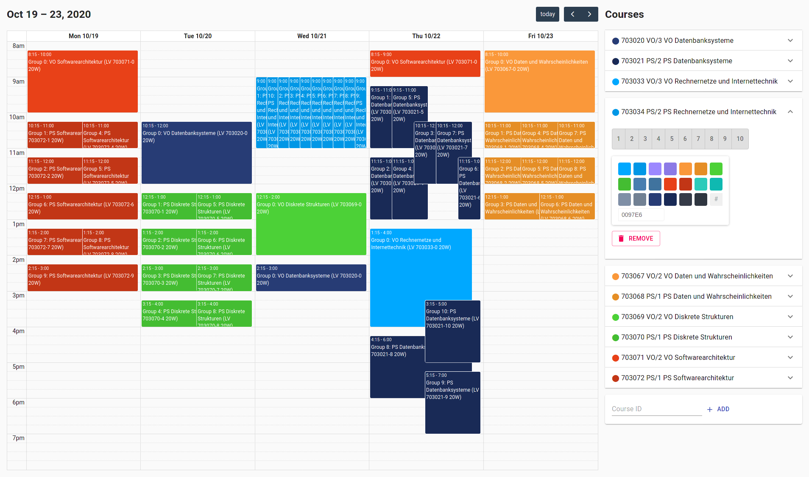
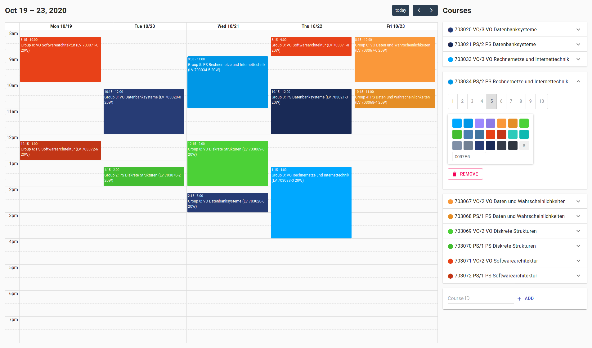

# Courses

Course planner for university.

Requires [courses-server](https://github.com/operrathor/courses-server) running on <localhost:3001>.

## Run

```console
$ npm start
```

## Screenshots

### All groups selected



### One group per course selected

